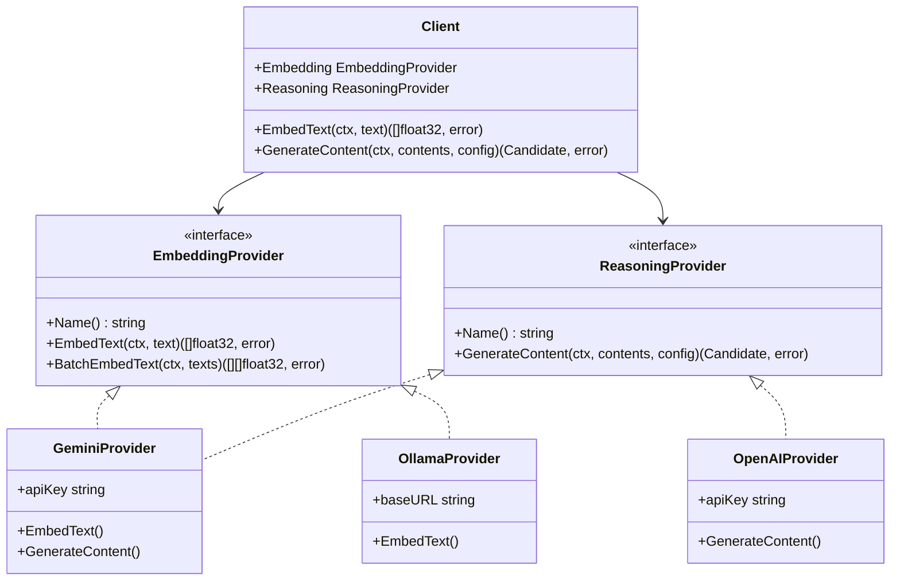

# Proposta di Architettura: Generalizzazione delle API AI (Embedding & Reasoning)

> [!NOTE]
> **Stato della proposta: APPROVATA E IMPLEMENTATA (Giugno 2026)**
> Questa proposta è stata interamente tradotta in codice funzionante nel modulo `internal/ai` e nel cablaggio globale dell'applicazione.

---

Questo documento descrive la proposta architetturale per astrarre e generalizzare l'accesso ai modelli di Intelligenza Artificiale per la generazione di **Embedding** e per il **Reasoning (Completamento/LLM)** all'interno del codebase `ibis-assistant`, impostando come default un **Ollama Runner locale gestito on-demand**.

---

## 1. Risposta ai Dubbi Principali

### Nota 1: Calcolo degli Embedding Local/Custom e Reasoning su LLM Closed
> **Domanda:** È possibile affidare gli embedding a modelli custom/locali e usare LLM potenti/closed per il reasoning? Come impatta la portabilità e il riuso degli embedding?

**Sì, è assolutamente possibile ed è una delle configurazioni RAG (Retrieval-Augmented Generation) più efficienti ed economiche.**

Il flusso RAG scollega nativamente i due passaggi:
1. **Fase di Embedding (Ricerca Semantica):** Si convertono i frammenti di codice, commit o issue in vettori usando un modello locale (es. `nomic-embed-text` o `bge-large-en` su Ollama). Il database vettoriale (SurrealDB nel nostro caso) memorizza questi vettori. Quando l'utente fa una domanda, la domanda viene convertita in vettore dallo *stesso* modello locale e viene eseguita la ricerca di similarità.
2. **Fase di Reasoning (Generazione della Risposta):** Il testo in chiaro dei frammenti più rilevanti trovati viene inserito come contesto nel prompt inviato al modello di reasoning closed (es. Gemini 2.5 Pro o GPT-4o). Il modello closed riceve solo testo e non ha alcuna consapevolezza di come quel testo sia stato recuperato.

#### Portabilità e Riuso degli Embedding:
* **Vincolo Fondamentale (Lo Spazio Vettoriale):** Gli embedding sono legati in modo indissolubile al modello che li ha generati. Non è possibile confrontare un vettore generato da `nomic-embed-text` con uno generato da `text-embedding-004` di Gemini. Hanno dimensioni diverse (es. 768 vs 1536) e una diversa distribuzione semantica dello spazio.
* **Strategia di Riuso:** Se mantieni stabile il tuo modello di embedding (anche locale), **non dovrai mai ricalcolare gli embedding nel database**, indipendentemente da quanti LLM di reasoning deciderai di cambiare (puoi passare da Gemini a OpenAI, a Claude o a Llama locale in qualsiasi momento).
* **Migrazione del Modello di Embedding:** Se decidi di cambiare il modello di embedding (es. per passare a uno più preciso), dovrai forzare una ricalcolazione totale (re-indexing) degli embedding per tutti i chunk presenti nel database. Con il `BatchManager` implementato, questo processo può essere automatizzato impostando lo stato dei chunk su `pending`.

---

### Nota 2: Interoperabilità e Mix di API Key di diversi Provider
> **Domanda:** Che tipo di interoperabilità posso ottenere? Posso mischiare API key di diversi provider (es. Gemini, OpenAI, Anthropic, Ollama) o devo affidarmi ad un unico LLM?

**Puoi ottenere una completa interoperabilità, mischiando liberamente provider e API key.**

Generalizzando l'interfaccia, l'applicazione non saprà (né le interesserà) quale provider esterno risponda, a patto che rispetti il contratto definito in Go. Potrai configurare:
* Un provider locale (es. **Ollama** senza necessità di API key) per gli embedding di massa dei sorgenti e dei commit (risparmiando sui costi delle API e garantendo la privacy del codice sorgente).
* Più provider commerciali (es. **Gemini** e **OpenAI**) con le rispettive API Key per il reasoning, magari assegnando compiti diversi in base alla potenza del modello (es. Gemini Flash per compiti di classificazione veloci ed economici, Gemini Pro o GPT-4o per la risoluzione dei bug).

---

## 2. Architettura Proposta in Go

Attualmente il client AI (`internal/ai/gemini.go`) è monolitico e accoppiato a Gemini. Proponiamo di ristrutturare il package `internal/ai` introducendo due interfacce distinte per separare le responsabilità:



### Le Nuove Interfacce (`internal/ai/types.go`)

```go
package ai

import "context"

// EmbeddingProvider definisce il contratto per i modelli di embedding
type EmbeddingProvider interface {
	Name() string
	EmbedText(ctx context.Context, text string) ([]float32, error)
	BatchEmbedText(ctx context.Context, texts []string) ([][]float32, error)
}

// ReasoningProvider definisce il contratto per i modelli di generazione e reasoning
type ReasoningProvider interface {
	Name() string
	GenerateContent(ctx context.Context, contents []Content, config GenerationConfig) (Candidate, error)
}
```

Il `Client` principale farà da orchestratore, esponendo i metodi richiesti dal resto del sistema e delegando le chiamate al provider corretto:

```go
type Client struct {
	Embedding EmbeddingProvider
	Reasoning ReasoningProvider
}

func (c *Client) EmbedText(ctx context.Context, text string) ([]float32, error) {
	return c.Embedding.EmbedText(ctx, text)
}

func (c *Client) BatchEmbedText(ctx context.Context, texts []string) ([][]float32, error) {
	return c.Embedding.BatchEmbedText(ctx, texts)
}

func (c *Client) GenerateContent(ctx context.Context, contents []Content, config GenerationConfig) (Candidate, error) {
	return c.Reasoning.GenerateContent(ctx, contents, config)
}
```

---

## 3. Gestione della Configurazione

Modificheremo la struttura di configurazione globale (`config_master.json`) per impostare di default il runner locale Ollama per gli embedding e Gemini per il reasoning:

```json
{
  "port": 3333,
  "ai": {
    "embedding": {
      "provider": "ollama",
      "model": "nomic-embed-text",
      "url": "http://127.0.0.1:11434",
      "auto_start": true,
      "auto_update": true
    },
    "reasoning": {
      "provider": "gemini",
      "model": "gemini-2.5-pro",
      "keys": [
        {
          "key": "",
          "rpm": 100,
          "tpm": 30000,
          "rpd": 1000,
          "owner": "Fabbio"
        }
      ]
    }
  }
}
```

---

## 4. Ollama Runner: Gestione del Processo e Autoinizializzazione

Per garantire un'esperienza utente fluida e zero-config (esattamente come avviene per SurrealDB tramite `db.ProcessManager`), implementeremo un gestore del ciclo di vita di Ollama in `internal/ai/runner.go`:

### 1. Download on-demand di Ollama
Se `"auto_start"` è attivo e Ollama non è installato nel sistema:
* Il codice Go rileverà il sistema operativo (Windows/Linux/macOS) e l'architettura.
* Scaricherà il binario leggero ufficiale di Ollama (o archivio tar/zip) direttamente da GitHub Releases o dalla CDN ufficiale di Ollama.
* Salverà l'eseguibile nella cartella dell'applicazione (es. `ollama.exe` su Windows).

### 2. Gestione del Processo Background
* All'avvio dell'applicazione, se la porta `11434` non risponde, Go avvia il processo `ollama serve` in background reindirizzando l'output su `ollama.log`.
* Il runner attende che la porta risponda (timeout di 30 secondi).

### 3. Autoinizializzazione del Modello (Auto-Pull)
* Prima di servire le prime richieste di embedding, Go effettua una chiamata a `GET /api/tags` per verificare se il modello configurato (es. `nomic-embed-text`) è già presente localmente.
* Se il modello manca, Go effettua una chiamata a `POST /api/pull` con il payload `{"name": "nomic-embed-text"}`.
* Il runner rimane in attesa del completamento del download del modello, loggando lo stato di avanzamento. Essendo un modello di circa 280MB, il download si completa rapidamente.
* Una volta confermata la presenza del modello, il provider è pronto.

---

## 5. Piano di Migrazione Graduale

Per evitare di rompere il codice esistente in `internal/search` e `BatchManager`:
1. **Mantenere la firma di `search.AIProvider`**: L'interfaccia attualmente usata da `search.Service` esposta dal pacchetto `search` rimarrà compatibile.
2. **Spostare l'attuale codice Gemini in un adapter**: L'attuale implementazione dei worker pool e delle chiamate HTTP a Gemini verrà isolata in `internal/ai/providers/gemini/`.
3. **Creare l'adapter Ollama**: Implementeremo `internal/ai/providers/ollama/` per gestire le chiamate a `/api/embeddings` di Ollama.
4. **Inizializzazione**: All'avvio dell'applicazione (`main.go`), leggeremo la nuova sezione di configurazione, avvieremo l'Ollama Runner se necessario, e istanzieremo i due provider selezionati, passandoli al costruttore del client AI generalizzato.
