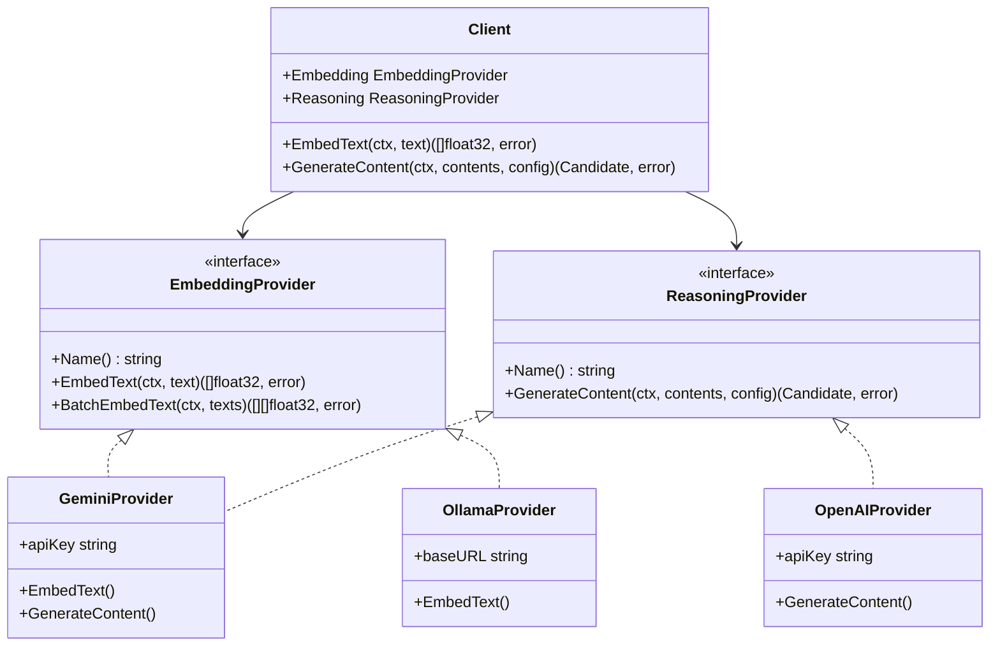

# Architecture Proposal: AI API Generalization (Embedding & Reasoning)

> [!NOTE]
> **Proposal status: APPROVED AND IMPLEMENTED (June 2026)** for embedding/reasoning interfaces and Ollama embed runner.
> **Superseded for hybrid multi-cloud / Settings UX (Sep 2026):** see [ai_and_settings.md](ai_and_settings.md) and [superpowers/specs/2026-09-19-hybrid-reasoning-settings-design.md](superpowers/specs/2026-09-19-hybrid-reasoning-settings-design.md). Historical text below remains for rationale.

---

This document describes the architectural proposal to abstract and generalize access to Artificial Intelligence models for **Embedding** generation and **Reasoning (Completion/LLM)** within the `ibis-assistant` codebase, defaulting to a **local Ollama Runner managed on-demand**.

---

## 1. Answers to Main Questions

### Note 1: Local/Custom Embeddings with Closed LLM Reasoning
> **Question:** Can embeddings use custom/local models while reasoning uses powerful/closed LLMs? How does that affect portability and embedding reuse?

**Yes — this is absolutely possible and is one of the most efficient and cost-effective RAG (Retrieval-Augmented Generation) configurations.**

The RAG flow natively decouples the two stages:
1. **Embedding phase (Semantic Search):** Convert code fragments, commits, or issues into vectors using a local model (e.g. `nomic-embed-text` or `bge-large-en` on Ollama). The vector database (SurrealDB in our case) stores these vectors. When the user asks a question, the question is converted to a vector by the *same* local model and similarity search runs.
2. **Reasoning phase (Answer Generation):** The plain text of the most relevant fragments is inserted as context into the prompt sent to a closed reasoning model (e.g. Gemini 2.5 Pro or GPT-4o). The closed model receives only text and has no awareness of how that text was retrieved.

#### Embedding Portability and Reuse:
* **Fundamental Constraint (Vector Space):** Embeddings are inseparably tied to the model that generated them. You cannot compare a vector from `nomic-embed-text` with one from Gemini's `text-embedding-004`. They have different dimensions (e.g. 768 vs 1536) and a different semantic distribution of the space.
* **Reuse Strategy:** If you keep your embedding model stable (even local), **you never need to recalculate embeddings in the database**, no matter how often you switch reasoning LLMs (Gemini, OpenAI, Claude, or local Llama at any time).
* **Embedding Model Migration:** If you change the embedding model (e.g. for higher precision), you must force a full re-indexing of embeddings for all chunks in the database. With the implemented `BatchManager`, this can be automated by setting chunk state to `pending`.

---

### Note 2: Interoperability and Mixing API Keys Across Providers
> **Question:** What interoperability can I get? Can I mix API keys from different providers (e.g. Gemini, OpenAI, Anthropic, Ollama), or must I rely on a single LLM?

**You can achieve full interoperability, freely mixing providers and API keys.**

By generalizing the interface, the application will not know (nor care) which external provider responds, as long as it respects the Go contract. You can configure:
* A local provider (e.g. **Ollama**, no API key required) for bulk embeddings of sources and commits (saving API costs and keeping source code private).
* Multiple commercial providers (e.g. **Gemini** and **OpenAI**) with their respective API keys for reasoning, optionally assigning different tasks by model strength (e.g. Gemini Flash for fast/cheap classification, Gemini Pro or GPT-4o for bug resolution).

---

## 2. Proposed Go Architecture

Currently the AI client (`internal/ai/gemini.go`) is monolithic and coupled to Gemini. We propose restructuring the `internal/ai` package with two distinct interfaces to separate responsibilities:



### New Interfaces (`internal/ai/types.go`)

```go
package ai

import "context"

// EmbeddingProvider defines the contract for embedding models
type EmbeddingProvider interface {
	Name() string
	EmbedText(ctx context.Context, text string) ([]float32, error)
	BatchEmbedText(ctx context.Context, texts []string) ([][]float32, error)
}

// ReasoningProvider defines the contract for generation and reasoning models
type ReasoningProvider interface {
	Name() string
	GenerateContent(ctx context.Context, contents []Content, config GenerationConfig) (Candidate, error)
}
```

The main `Client` acts as orchestrator, exposing methods required by the rest of the system and delegating calls to the correct provider:

```go
type Client struct {
	Embedding EmbeddingProvider
	Reasoning ReasoningProvider
}

func (c *Client) EmbedText(ctx context.Context, text string) ([]float32, error) {
	return c.Embedding.EmbedText(ctx, text)
}

func (c *Client) BatchEmbedText(ctx context.Context, texts []string) ([][]float32, error) {
	return c.Embedding.BatchEmbedText(ctx, texts)
}

func (c *Client) GenerateContent(ctx context.Context, contents []Content, config GenerationConfig) (Candidate, error) {
	return c.Reasoning.GenerateContent(ctx, contents, config)
}
```

---

## 3. Configuration Management

We will update the global configuration structure (`config_master.json`) to default to the local Ollama runner for embeddings and Gemini for reasoning:

```json
{
  "port": 3333,
  "ai": {
    "embedding": {
      "provider": "ollama",
      "model": "nomic-embed-text",
      "url": "http://127.0.0.1:11434",
      "auto_start": true,
      "auto_update": true
    },
    "reasoning": {
      "provider": "gemini",
      "model": "gemini-2.5-pro",
      "keys": [
        {
          "key": "",
          "rpm": 100,
          "tpm": 30000,
          "rpd": 1000,
          "owner": "local"
        }
      ]
    }
  }
}
```

---

## 4. Ollama Runner: Process Management and Auto-Initialization

To ensure a smooth zero-config user experience (exactly as SurrealDB via `db.ProcessManager`), we will implement an Ollama lifecycle manager in `internal/ai/runner.go`:

### 1. On-demand Ollama download
If `"auto_start"` is enabled and Ollama is not installed:
* The Go code detects the OS (Windows/Linux/macOS) and architecture.
* It downloads the official lightweight Ollama binary (or tar/zip archive) from GitHub Releases or the official Ollama CDN.
* It saves the executable in the application folder (e.g. `ollama.exe` on Windows).

### 2. Background process management
* On application startup, if port `11434` does not respond, Go starts `ollama serve` in the background, redirecting output to `ollama.log`.
* The runner waits for the port to respond (30-second timeout).

### 3. Model auto-initialization (Auto-Pull)
* Before serving the first embedding requests, Go calls `GET /api/tags` to check whether the configured model (e.g. `nomic-embed-text`) is already present locally.
* If the model is missing, Go calls `POST /api/pull` with payload `{"name": "nomic-embed-text"}`.
* The runner waits for the model download to complete, logging progress. At roughly 280MB, the download finishes quickly.
* Once the model is confirmed present, the provider is ready.

---

## 5. Gradual Migration Plan

To avoid breaking existing code in `internal/search` and `BatchManager`:
1. **Keep the `search.AIProvider` signature**: The interface currently used by `search.Service` from the `search` package remains compatible.
2. **Move current Gemini code into an adapter**: The existing worker-pool implementation and Gemini HTTP calls will be isolated in `internal/ai/providers/gemini/`.
3. **Create the Ollama adapter**: Implement `internal/ai/providers/ollama/` for calls to Ollama's `/api/embeddings`.
4. **Initialization**: On application startup (`main.go`), read the new configuration section, start the Ollama Runner if needed, and instantiate the two selected providers, passing them to the generalized AI client constructor.
