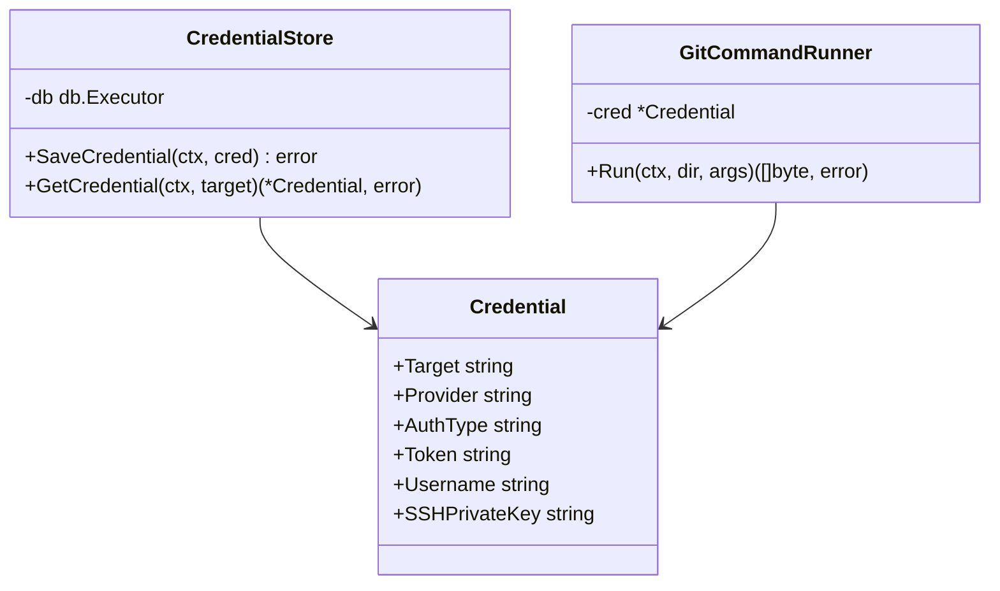

# Architecture Proposal: Git Access Generalization and Credential Management

> [!NOTE]
> **Proposal status: APPROVED (June 2026)**
> This proposal has been approved for incremental phased implementation described in the operational guide `docs/git_implementation_instructions.md`.

---

This document describes the architectural proposal to abstract and generalize Git repository access within the Ibis Assistant codebase, introducing credential persistence in SurrealDB, support for runtime overrides via HTTP headers, and resolution of the "first use unconfigured" scenario on a self-hosted instance.

---

## 1. Context Analysis and Design Decisions

### Note 1: Self-hosted instance and local checkout
> **Scenario:** Ibis Assistant runs as a personal/self-hosted instance (`localhost` or a dedicated host). Private repositories are indexed with the operator's own credentials (Azure DevOps PAT, GitHub, etc.).

**Proposed solution:**
1. **Single repository on the server:** Indexing and the SurrealDB graph use *one local copy* of the repository (under `discovery_root/dynamic`).
2. **System credentials (default):** At first configuration a default credential can be stored per repository or provider, reused for background syncs.
3. **Runtime override:** The HTTP header `X-Git-Token` (or `X-Git-PAT`) temporarily overrides the persisted credential for the single operation (not stored on disk or in the DB).

---

### Note 2: Behavior on first use (unconfigured)
> **Question:** How does the system behave if a private repository is requested for the first time and no credentials are configured on the server?

**Proposed operational flow (on-demand key request):**
1. The client (e.g. IDE extension or development agent) sends a command such as `init_project` for a new private repository.
2. The server attempts `git clone` / `git fetch`. If it detects missing credentials or an authentication failure:
   * It interrupts the operation immediately.
   * It returns a structured JSON payload with a specific error:
     ```json
     {
       "status": "credentials_required",
       "provider": "github",
       "target": "github.com",
       "message": "Git credentials are required to access this repository. Please configure them using the git_configure_credentials tool or provide them via X-Git-Token header."
     }
     ```
3. The development agent captures this response and shows an interactive prompt to the user to request a Personal Access Token (PAT).
4. Once entered, the client sends the configuration via the new MCP tool `git_configure_credentials`, which persists the token in SurrealDB at server level, enabling autonomous access from that point on.

---

### Note 3: Credential leak prevention (log masking)
Because executing git commands can print passed arguments in output (including tokens or URLs containing basic-auth credentials), a `GitCommandRunner` wrapper will be implemented. This runner will:
* Intercept all executed command output (stdout and stderr).
* Detect and replace sensitive strings (e.g. patterns related to configured tokens) with `[REDACTED]` before sending them to the server logger (`server.log`) or returning them in errors.

---

## 2. Proposed Go Architecture

The new package `internal/gitrepo` is introduced to centralize repository and key management:



### Credential structure (`internal/gitrepo/types.go`)
```go
package gitrepo

type ProviderName string

const (
	ProviderGitHub      ProviderName = "github"
	ProviderGitLab      ProviderName = "gitlab"
	ProviderAzureDevOps ProviderName = "azure_devops"
	ProviderGeneric     ProviderName = "generic"
)

type AuthType string

const (
	AuthTypeToken AuthType = "token"
	AuthTypeBasic AuthType = "basic"
	AuthTypeSSH   AuthType = "ssh"
)

type Credential struct {
	Target        string   `json:"target"` // Domain (github.com) or full repo URL
	Provider      string   `json:"provider"`
	AuthType      AuthType `json:"auth_type"`
	Token         string   `json:"token,omitempty"`
	Username      string   `json:"username,omitempty"`
	SSHPrivateKey string   `json:"ssh_private_key,omitempty"`
}
```

---

## 3. SurrealDB Schema

Credentials persisted on the server are stored in the `git_credential` table defined in `internal/schema/schema.go`:

```sql
DEFINE TABLE git_credential SCHEMALESS;
DEFINE INDEX credential_target ON TABLE git_credential COLUMNS target UNIQUE;
```

---

## 4. Credential Resolution during Sync
When a synchronization job is started (`SyncWorkspace`):
1. Check whether a runtime token is present in `context.Context` (injected by `AuthMiddleware` from the `X-Git-Token` header).
2. If not present, query the `CredentialStore` in SurrealDB using:
   * The specific repository URL (e.g. `https://github.com/myorg/myrepo`).
   * The provider domain (e.g. `github.com`) as a general fallback.
3. If not present, check the legacy configuration in `config.json` (`git_tokens`).
4. If no credential is found and the repository is private (or the git command fails with exit code 128 / auth error), return `CredentialsRequiredError` to trigger on-demand configuration.
