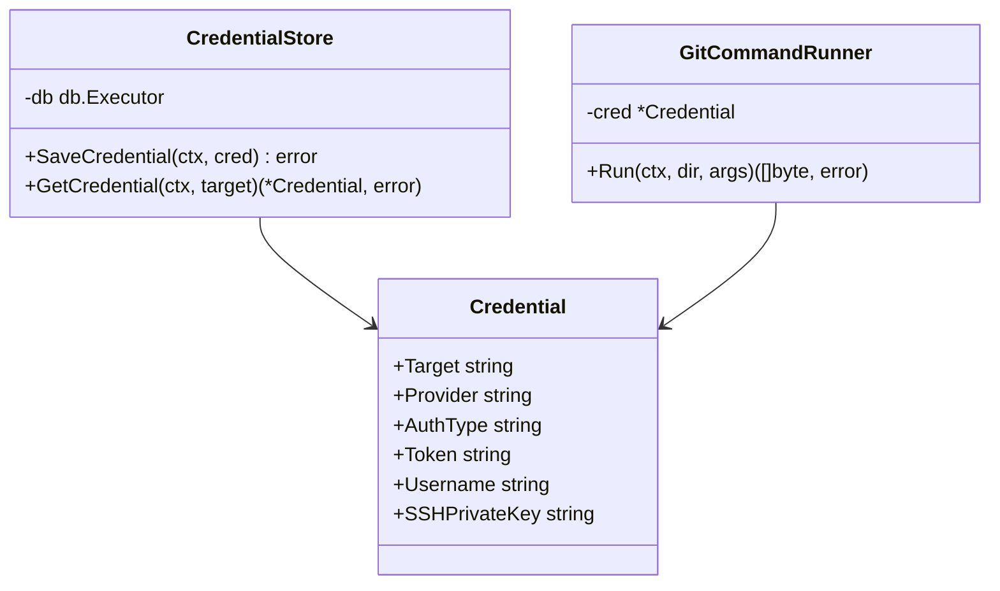

# Proposta di Architettura: Generalizzazione Accesso Git e Gestione Credenziali

> [!NOTE]
> **Stato della proposta: APPROVATA (Giugno 2026)**
> Questa proposta è stata approvata per l'implementazione in fasi incrementali descritte nella guida operativa `docs/git_implementation_instructions.md`.

---

Questo documento descrive la proposta architetturale per astrarre e generalizzare l'accesso ai repository Git all'interno del codebase `ibis-assistant`, introducendo la persistenza delle credenziali in SurrealDB, il supporto per override runtime tramite header HTTP e la risoluzione dello scenario "primo utilizzo non configurato" in un server centralizzato per team di sviluppo.

---

## 1. Analisi del Contesto e Decisioni di Design

### Nota 1: Server di Team e Checkout Condivisi
> **Scenario:** Ibis Assistant è un server centrale a disposizione di un intero team di sviluppo (`localhost`). Gli sviluppatori lavorano sugli stessi repository privati ma possiedono credenziali personali distinte (es. Token PAT Azure DevOps o GitHub).

**Soluzione Proposta:**
1. **Repository Unico sul Server:** Poiché il server esegue l'indicizzazione del codice e la costruzione del grafo di conoscenza in SurrealDB in modo centralizzato, sul server esiste *una sola copia locale* del repository (salvata sotto `discovery_root/dynamic`).
2. **Uso di Credenziali di Sistema (Default/Shared):** Quando il primo sviluppatore configura o usa il repository, il server può memorizzare una credenziale di default per quel repository o per l'intero provider (es. un PAT di un utente tecnico o il PAT del primo utente se condiviso). Questa credenziale verrà riutilizzata per le sincronizzazioni successive in background.
3. **Override Runtime (Per-User):** Per garantire la privacy o utilizzare permessi specifici durante le richieste sincrone dell'utente, l'applicazione supporterà l'header HTTP `X-Git-Token` (o `X-Git-PAT`). Se presente, questo token farà l'override temporaneo di qualsiasi credenziale persistita sul server per la singola operazione (senza essere memorizzato su disco o DB).

---

### Nota 2: Comportamento al Primo Utilizzo (Unconfigured)
> **Domanda:** Come si comporta il sistema se un repository privato viene richiesto per la prima volta e non ci sono credenziali configurate nel server?

**Flusso Operativo Proposto (Richiesta Chiave On-Demand):**
1. Il client (es. estensione IDE o agente di sviluppo) invia un comando come `init_project` per un nuovo repository privato.
2. Il server tenta l'operazione di `git clone` / `git fetch`. Se rileva la mancanza di credenziali o un fallimento di autenticazione:
   * Interrompe l'operazione immediatamente.
   * Ritorna un payload JSON strutturato con un errore specifico:
     ```json
     {
       "status": "credentials_required",
       "provider": "github",
       "target": "github.com",
       "message": "Git credentials are required to access this repository. Please configure them using the git_configure_credentials tool or provide them via X-Git-Token header."
     }
     ```
3. L'agente di sviluppo cattura questa risposta e mostra un prompt interattivo all'utente per richiedere il Personal Access Token (PAT).
4. Una volta inserito, il client invia la configurazione tramite il nuovo tool MCP `git_configure_credentials`, che persiste il token su SurrealDB a livello di server, abilitando l'accesso autonomo da quel momento in poi.

---

### Nota 3: Prevenzione Leak Credenziali (Log Masking)
Poiché l'esecuzione di comandi git può stampare in output gli argomenti passati (inclusi eventuali token o URL contenenti credenziali basic-auth), verrà implementato un wrapper `GitCommandRunner`. Questo runner si occuperà di:
* Intercettare tutti gli output dei comandi eseguiti (stdout e stderr).
* Rilevare e sostituire stringhe sensibili (es. pattern legati ai token configurati) con `[REDACTED]` prima di inviarli al logger del server (`server.log`) o di ritornarli negli errori.

---

## 2. Architettura Proposta in Go

Viene introdotto il nuovo package `internal/gitrepo` per centralizzare la gestione dei repository e delle chiavi:



### Struttura Credenziale (`internal/gitrepo/types.go`)
```go
package gitrepo

type ProviderName string

const (
	ProviderGitHub      ProviderName = "github"
	ProviderGitLab      ProviderName = "gitlab"
	ProviderAzureDevOps ProviderName = "azure_devops"
	ProviderGeneric     ProviderName = "generic"
)

type AuthType string

const (
	AuthTypeToken AuthType = "token"
	AuthTypeBasic AuthType = "basic"
	AuthTypeSSH   AuthType = "ssh"
)

type Credential struct {
	Target        string   `json:"target"` // Dominio (github.com) o repo URL completo
	Provider      string   `json:"provider"`
	AuthType      AuthType `json:"auth_type"`
	Token         string   `json:"token,omitempty"`
	Username      string   `json:"username,omitempty"`
	SSHPrivateKey string   `json:"ssh_private_key,omitempty"`
}
```

---

## 3. Schema SurrealDB

Le credenziali persistite sul server vengono memorizzate nella tabella `git_credential` definita in `internal/schema/schema.go`:

```sql
DEFINE TABLE git_credential SCHEMALESS;
DEFINE INDEX credential_target ON TABLE git_credential COLUMNS target UNIQUE;
```

---

## 4. Risoluzione della Credenziale durante il Sync
Quando viene avviato un job di sincronizzazione (`SyncWorkspace`):
1. Si controlla se nel `context.Context` è presente un token runtime (inserito da `AuthMiddleware` dall'header `X-Git-Token`).
2. Se non presente, si interroga il `CredentialStore` in SurrealDB usando:
   * L'URL specifico del repository (es. `https://github.com/myorg/myrepo`).
   * Il dominio del provider (es. `github.com`) come fallback generale.
3. Se non presente, si controlla la configurazione legacy in `config.json` (`git_tokens`).
4. Se non si trova alcuna credenziale e il repository è privato (o il git comando fallisce con errore 128 / Auth error), viene restituito l'errore `CredentialsRequiredError` per innescare la configurazione on-demand.
