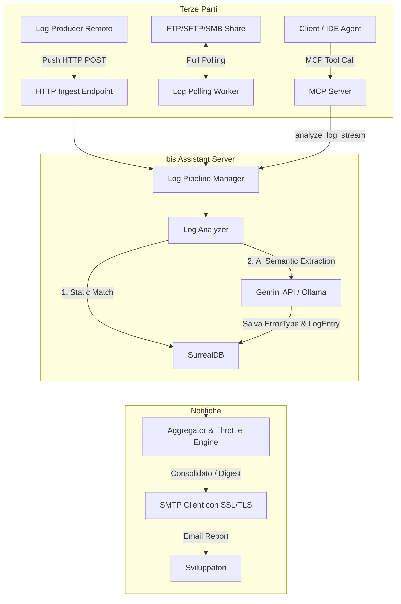

# Proposta di Architettura: Estensione, Integrazione e Riforma del Log Analyzer

> [!NOTE]
> **Stato della proposta: IN VALUTAZIONE (Giugno 2026)**
> Questo documento descrive la proposta architetturale per superare le limitazioni correnti del modulo di Log Analysis di `ibis-assistant`, introducendo canali di ricezione di terze parti (Push API, Polling FTP/SFTP/SMB, MCP) e risolvendo i bug storici legati all'invio di notifiche e-mail.

---

## 1. Analisi del Contesto e Limitazioni Attuali

Il modulo di log analysis integrato in `ibis-assistant` è stato inizialmente progettato ipotizzando che il servizio girasse sulla stessa macchina del produttore di log (Log Producer), eseguendo il monitoraggio locale "rolling" tramite `fsnotify` e `nxadm/tail`.

Tuttavia, nell'uso reale (server centralizzato su rete aziendale), questo approccio presenta i seguenti limiti fondamentali:
1. **Accoppiamento Fisico**: Il server non ha accesso diretto ai file system locali delle macchine o dei container in cui girano le applicazioni da monitorare.
2. **Incompatibilità di fsnotify su File System di Rete**: Se la cartella dei log (`logs_root`) viene montata tramite condivisioni SMB o NFS, le API del sistema operativo (es. inotify/fsnotify) spesso non rilevano i cambiamenti di scrittura effettuati da macchine esterne, bloccando l'analisi rolling.
3. **Mancanza di Canali Push/Pull**: Non vi è alcun modo per le applicazioni terze di inviare attivamente (Push) i propri log al server, né per il server di andarseli a prendere (Pull) da sorgenti remote.
4. **Instabilità del Sistema E-mail (SMTP)**:
   * **Autenticazione Rigida**: L'uso esclusivo di `smtp.PlainAuth` fallisce sui server SMTP aziendali che non richiedono autenticazione (relay interni) o che richiedono meccanismi diversi.
   * **Assenza di SSL/TLS Implicito**: La libreria standard `smtp.SendMail` di Go supporta nativamente solo connessioni in chiaro o STARTTLS (solitamente porta 587/25). Se il server SMTP richiede SSL/TLS Implicito (porta 465), la connessione si blocca in timeout (hang).
   * **Email Flooding**: Il sistema attuale invia un'e-mail a ogni completamento di batch/tailer. Se un log produce centinaia di errori in breve tempo, la casella di posta viene inondata di notifiche.

---

## 2. Architettura Multicanale di Ingestione (Push & Pull)

Per rendere il Log Analyzer flessibile e integrabile con qualsiasi infrastruttura, si propone di estendere l'ingestione su tre canali principali:



---

### A. Modello Push: HTTP API & Webhook
Verrà implementato un endpoint HTTP dedicato all'interno del server web di `ibis-assistant` per ricevere i log.

* **Endpoint**: `POST /api/v1/logs/upload`
* **Autenticazione**: API Key passata tramite header `X-API-Key` o Bearer Token.
* **Payload**: Il server supporterà sia file di log raw (Multipart Form) che JSON strutturati.
  ```json
  {
    "project": "ProjectA",
    "filename": "server_err.log",
    "content": "... testo dei log ..."
  }
  ```
* **Vantaggi**: Facile da integrare in script di deploy, pipeline CI/CD (GitHub Actions, GitLab CI) o come target di configurazioni di logger (es. Serilog HTTP sink, Logstash, FluentBit).

---

### B. Modello Pull: Polling FTP / SFTP / SMB
Un worker in background (`LogPullScheduler`) eseguirà scansioni periodiche su server remoti configurati per prelevare i log e storicizzarli.

* **Protocolli Supportati**: FTP, SFTP (SSH File Transfer), SMB (condivisioni Windows).
* **Strategia Anti-Duplicazione**: 
  1. Il worker scarica i file che corrispondono a un determinato pattern (es. `*.log`).
  2. Esegue l'ingestione del file tramite il `LogAnalyzer`.
  3. Sposta il file in una sottocartella di archiviazione remota (es. `/archive/`) o lo rinomina (es. `.log.processed`) per evitare di rielaborarlo al ciclo successivo.
* **Configurazione**: Dichiarata in `config.json` come array di sorgenti.

---

### C. Modello MCP: Strumento Dedicato per Agenti
Verrà aggiunto un nuovo tool MCP per consentire agli agenti AI (come Claude o Gemini operanti lato client) o a estensioni IDE di inviare blocchi di log visualizzati sul terminale dell'utente.

* **Tool**: `analyze_log_stream`
* **Parametri**:
  * `project_name` (string, required): Nome del progetto.
  * `log_data` (string, required): Il blocco di testo del log da analizzare.
  * `source_context` (string, optional): Dettagli sulla provenienza (es. "Terminal output", "Docker logs").
* **Output (Sincrono)**: Il tool blocca l'esecuzione ed elabora i log in tempo reale. Restituisce in risposta i risultati dell'analisi (array degli errori/anomalie rilevati con categorie, stack trace, livelli di severity, file correlati e il report markdown generato). Questo permette all'agente chiamante di attendere il completamento dell'elaborazione e agire subito sui risultati.

---

## 3. Riforma del Sistema di Notifica (Email & Report)

Per rendere il sistema di reporting affidabile ed evitare il sovraccarico di comunicazioni, si propone di implementare i seguenti miglioramenti.

### A. Risoluzione dei Bug SMTP (STARTTLS vs SSL/TLS Implicito)
Il client di notifica (`notifier.go`) verrà riscritto per supportare diversi tipi di cifratura:
1. **SSL/TLS Implicito (Porta 465)**: Connessione crittografata immediata tramite `crypto/tls`.
2. **STARTTLS (Porta 587 / 25)**: Connessione inizialmente in chiaro, poi elevata a TLS tramite comando `STARTTLS`.
3. **Nessuna Autenticazione (Relay)**: Supporto per server SMTP locali che non richiedono username e password.

```go
// Esempio logico di connessione robusta
func connectSMTP(cfg SMTPConfig) (*smtp.Client, error) {
    addr := fmt.Sprintf("%s:%d", cfg.Host, cfg.Port)
    if cfg.Encryption == "ssl_tls" {
        tlsConfig := &tls.Config{ServerName: cfg.Host}
        conn, err := tls.Dial("tcp", addr, tlsConfig)
        if err != nil {
            return nil, err
        }
        return smtp.NewClient(conn, cfg.Host)
    }
    
    // Fallback standard / STARTTLS
    client, err := smtp.Dial(addr)
    if err != nil {
        return nil, err
    }
    if cfg.Encryption == "starttls" {
        tlsConfig := &tls.Config{ServerName: cfg.Host}
        if err := client.StartTLS(tlsConfig); err != nil {
            return nil, err
        }
    }
    return client, nil
}
```

### B. Aggregazione e Throttling delle Notifiche
Invece di inviare un'e-mail a ogni batch, viene introdotto un motore di throttling:
* **Aggregation Window**: Finestra temporale di accumulo (es. 1 ora, 24 ore). Gli errori rilevati vengono collezionati nel DB.
* **Daily Digest**: Un'unica e-mail riassuntiva giornaliera che elenca tutti i nuovi tipi di errore rilevati, la frequenza e la gravità.
* **Soglia di Emergenza (Alert)**: Se viene rilevato un errore con gravità superiore a una soglia configurata (es. `severity >= 9`), l'e-mail di alert viene inviata immediatamente bypassando il throttling.

---

## 4. Dettaglio delle Modifiche al Codice e Configurazione

### Configurazione Estesa (`internal/config/config.go`)
Verranno introdotte le seguenti nuove sezioni in `config.json`:

```json
{
  "log_ingestion": {
    "http": {
      "enabled": true,
      "api_key": ""
    },
    "polling": [
      {
        "name": "Production_SFTP",
        "enabled": true,
        "protocol": "sftp",
        "host": "sftp.company.com",
        "port": 22,
        "user": "log_reader",
        "password": "",
        "remote_dir": "/var/log/nginx",
        "file_pattern": "*.log",
        "archive_dir": "/var/log/nginx/processed",
        "poll_interval": "30m",
        "project_name": "WebGateway"
      }
    ]
  },
  "smtp": {
    "enabled": true,
    "host": "smtp.company.com",
    "port": 465,
    "encryption": "ssl_tls", 
    "user": "noreply@company.com",
    "password": "",
    "from": "Ibis Assistant <noreply@company.com>",
    "to": "dev-team@company.com",
    "aggregation_window": "1h",
    "emergency_severity_threshold": 9
  }
}
```

### Struttura Go per il Polling (`internal/ingest/logs/polling.go`)
Verrà creato un nuovo file dedicato alla gestione del polling dei log remoti:

```go
package logs

import (
	"context"
	"time"
	"github.com/terenzif/ibis-assistant/internal/config"
	"github.com/terenzif/ibis-assistant/internal/db"
)

type PollingSource struct {
	Name         string
	Protocol     string // ftp, sftp, smb
	Host         string
	Port         int
	User         string
	Password     string
	RemoteDir    string
	FilePattern  string
	ArchiveDir   string
	PollInterval time.Duration
	ProjectName  string
}

type LogPullScheduler struct {
	DB      db.Executor
	Sources []PollingSource
}

func (s *LogPullScheduler) Start(ctx context.Context) {
    // Esecuzione periodica per ogni sorgente configurata
}
```

### Schema SurrealDB (`internal/schema/schema.go`)
Aggiunta del tracciamento dei log elaborati e delle notifiche per evitare duplicati in SurrealDB:

```sql
-- Tabella per tracciare i file remoti già scaricati ed elaborati (per evitare re-importazioni)
DEFINE TABLE log_processed_file SCHEMALESS;
DEFINE INDEX file_hash ON TABLE log_processed_file COLUMNS hash UNIQUE;

-- Tabella per accumulare le notifiche e-mail prima dell'invio aggregato (Throttling)
DEFINE TABLE log_pending_notification SCHEMALESS;
```

---

## 5. Piano di Implementazione Suggerito

L'implementazione delle modifiche può essere strutturata in 3 fasi incrementali:

### Fase 1: Riforma SMTP & Notifiche (Alta Priorità)
* Modifica del pacchetto `config` per supportare il campo `encryption` nell'oggetto SMTP.
* Riscrittura di `notifier.go` per supportare SSL/TLS implicito e STARTTLS.
* Introduzione del test di invio e-mail tramite CLI o tool dedicato per verificare immediatamente le credenziali SMTP.

### Fase 2: Endpoint HTTP & Tool MCP (Push Model)
* Esposizione dell'endpoint HTTP POST `/api/v1/logs/upload` in `cmd/server/main.go`.
* Implementazione dell'autenticazione tramite API Key.
* Aggiunta del tool MCP `analyze_log_stream` nel server per l'analisi sincrona on-demand (attesa dell'analisi e risposta con i dettagli degli errori).
* Modifica del `LogAnalyzer` per processare stringhe di testo arbitrarie provenienti da API senza richiedere un file fisico locale.

### Fase 3: Polling Scheduler (Pull Model)
* Creazione del scheduler `LogPullScheduler` in Go.
* Integrazione delle librerie client FTP (`github.com/jlaffaye/ftp`), SFTP (`github.com/pkg/sftp`) o SMB (`github.com/hirochachacha/go-smb2`).
* Implementazione dello spostamento nel folder `/archive` post-elaborazione.
