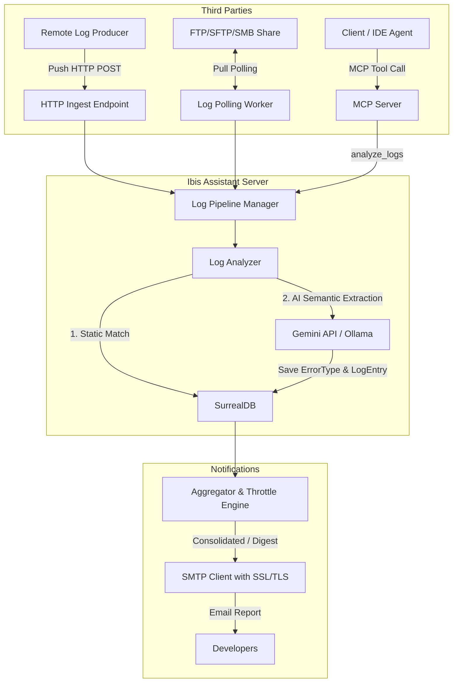

# Architecture Proposal: Log Analyzer Extension, Integration, and Reform

> [!NOTE]
> **Proposal status: IMPLEMENTED** (channels + SMTP reform landed mid-2026; September 2026 extended the analysis pipeline — see [log_analysis_pipeline.md](log_analysis_pipeline.md) and [changelog_20260918.md](changelog_20260918.md)).
> Historical proposal text below is kept for design rationale. The live MCP tool name is **`analyze_logs`** (not `analyze_log_stream`).

---

## 1. Context Analysis and Current Limitations

The log analysis module integrated in Ibis Assistant was initially designed assuming the service ran on the same machine as the log producer, performing local "rolling" monitoring via `fsnotify` and `nxadm/tail`.

However, in real use (centralized server on a company network), this approach has the following fundamental limits:
1. **Physical coupling**: The server has no direct access to the local file systems of the machines or containers where the applications to monitor run.
2. **fsnotify incompatibility on network file systems**: If the log folder (`logs_root`) is mounted via SMB or NFS shares, operating system APIs (e.g. inotify/fsnotify) often do not detect write changes made by external machines, blocking rolling analysis.
3. **No push/pull channels**: There is no way for third-party applications to actively send (push) their logs to the server, nor for the server to fetch them (pull) from remote sources.
4. **Email system instability (SMTP)**:
   * **Rigid authentication**: Exclusive use of `smtp.PlainAuth` fails on corporate SMTP servers that do not require authentication (internal relays) or that require different mechanisms.
   * **No implicit SSL/TLS**: Go's standard `smtp.SendMail` library natively supports only cleartext or STARTTLS connections (usually ports 587/25). If the SMTP server requires implicit SSL/TLS (port 465), the connection hangs on timeout.
   * **Email flooding**: The current system sends an email on every batch/tailer completion. If a log produces hundreds of errors in a short time, the mailbox is flooded with notifications.

---

## 2. Multi-Channel Ingestion Architecture (Push & Pull)

To make the Log Analyzer flexible and integrable with any infrastructure, ingestion is proposed to be extended across three main channels:



---

### A. Push Model: HTTP API & Webhook
A dedicated HTTP endpoint will be implemented inside the Ibis Assistant web server to receive logs.

* **Endpoint**: `POST /api/v1/logs/upload`
* **Authentication**: API Key passed via `X-API-Key` header or Bearer Token.
* **Payload**: The server will support both raw log files (Multipart Form) and structured JSON.
  ```json
  {
    "project": "ProjectA",
    "filename": "server_err.log",
    "content": "... log text ..."
  }
  ```
* **Benefits**: Easy to integrate in deploy scripts, CI/CD pipelines (GitHub Actions, GitLab CI), or as a target for logger configurations (e.g. Serilog HTTP sink, Logstash, FluentBit).

---

### B. Pull Model: FTP / SFTP / SMB Polling
A background worker (`LogPullScheduler`) will periodically scan configured remote servers to fetch logs and store them historically.

* **Supported protocols**: FTP, SFTP (SSH File Transfer), SMB (Windows shares).
* **Anti-duplication strategy**: 
  1. The worker downloads files matching a given pattern (e.g. `*.log`).
  2. It ingests the file via `LogAnalyzer`.
  3. It moves the file to a remote archive subdirectory (e.g. `/archive/`) or renames it (e.g. `.log.processed`) to avoid reprocessing on the next cycle.
* **Configuration**: Declared in `config.json` as an array of sources.

---

### C. MCP Model: Dedicated Tool for Agents
A new MCP tool will be added so AI agents (such as Claude or Gemini on the client side) or IDE extensions can send log blocks displayed on the user's terminal.

* **Tool**: `analyze_logs`
* **Parameters**:
  * `project_name` (string, required): Project name.
  * `log_data` (string, required): The log text block to analyze.
  * `source_context` (string, optional): Provenance details (e.g. "Terminal output", "Docker logs").
* **Output (synchronous)**: The tool blocks execution and processes logs in real time. It returns analysis results (array of detected errors/anomalies with categories, stack traces, severity levels, related files, and the generated markdown report). This allows the calling agent to wait for processing to complete and act immediately on the results.

---

## 3. Notification System Reform (Email & Report)

To make reporting reliable and avoid communication overload, the following improvements are proposed.

### A. Fixing SMTP Bugs (STARTTLS vs Implicit SSL/TLS)
The notification client (`notifier.go`) will be rewritten to support different encryption types:
1. **Implicit SSL/TLS (Port 465)**: Immediate encrypted connection via `crypto/tls`.
2. **STARTTLS (Port 587 / 25)**: Initially cleartext connection, then upgraded to TLS via `STARTTLS`.
3. **No authentication (relay)**: Support for local SMTP servers that do not require username and password.

```go
// Logical example of a robust connection
func connectSMTP(cfg SMTPConfig) (*smtp.Client, error) {
    addr := fmt.Sprintf("%s:%d", cfg.Host, cfg.Port)
    if cfg.Encryption == "ssl_tls" {
        tlsConfig := &tls.Config{ServerName: cfg.Host}
        conn, err := tls.Dial("tcp", addr, tlsConfig)
        if err != nil {
            return nil, err
        }
        return smtp.NewClient(conn, cfg.Host)
    }
    
    // Standard / STARTTLS fallback
    client, err := smtp.Dial(addr)
    if err != nil {
        return nil, err
    }
    if cfg.Encryption == "starttls" {
        tlsConfig := &tls.Config{ServerName: cfg.Host}
        if err := client.StartTLS(tlsConfig); err != nil {
            return nil, err
        }
    }
    return client, nil
}
```

### B. Notification Aggregation and Throttling
Instead of sending an email on every batch, a throttling engine is introduced:
* **Aggregation window**: Accumulation time window (e.g. 1 hour, 24 hours). Detected errors are collected in the DB.
* **Daily digest**: A single daily summary email listing all newly detected error types, frequency, and severity.
* **Emergency threshold (alert)**: If an error with severity above a configured threshold is detected (e.g. `severity >= 9`), the alert email is sent immediately, bypassing throttling.

---

## 4. Code and Configuration Change Details

### Extended configuration (`internal/config/config.go`)
The following new sections will be introduced in `config.json`:

```json
{
  "log_ingestion": {
    "http": {
      "enabled": true,
      "api_key": ""
    },
    "polling": [
      {
        "name": "Production_SFTP",
        "enabled": true,
        "protocol": "sftp",
        "host": "localhost",
        "port": 22,
        "user": "log_reader",
        "password": "",
        "remote_dir": "/var/log/nginx",
        "file_pattern": "*.log",
        "archive_dir": "/var/log/nginx/processed",
        "poll_interval": "30m",
        "project_name": "WebGateway"
      }
    ]
  },
  "smtp": {
    "enabled": true,
    "host": "localhost",
    "port": 465,
    "encryption": "ssl_tls", 
    "user": "noreply@localhost",
    "password": "",
    "from": "Ibis Assistant <noreply@localhost>",
    "to": "dev-team@localhost",
    "aggregation_window": "1h",
    "emergency_severity_threshold": 9
  }
}
```

### Go structure for polling (`internal/ingest/logs/polling.go`)
A new file dedicated to remote log polling management will be created:

```go
package logs

import (
	"context"
	"time"
	"github.com/terenzif/ibis-assistant/internal/config"
	"github.com/terenzif/ibis-assistant/internal/db"
)

type PollingSource struct {
	Name         string
	Protocol     string // ftp, sftp, smb
	Host         string
	Port         int
	User         string
	Password     string
	RemoteDir    string
	FilePattern  string
	ArchiveDir   string
	PollInterval time.Duration
	ProjectName  string
}

type LogPullScheduler struct {
	DB      db.Executor
	Sources []PollingSource
}

func (s *LogPullScheduler) Start(ctx context.Context) {
    // Periodic execution for each configured source
}
```

### SurrealDB schema (`internal/schema/schema.go`)
Addition of tracking for processed logs and notifications to avoid duplicates in SurrealDB:

```sql
-- Table to track remote files already downloaded and processed (to avoid re-imports)
DEFINE TABLE log_processed_file SCHEMALESS;
DEFINE INDEX file_hash ON TABLE log_processed_file COLUMNS hash UNIQUE;

-- Table to accumulate email notifications before aggregated send (Throttling)
DEFINE TABLE log_pending_notification SCHEMALESS;
```

---

## 5. Suggested Implementation Plan

Implementation of the changes can be structured in 3 incremental phases:

### Phase 1: SMTP & Notification Reform (High Priority)
* Modify the `config` package to support the `encryption` field in the SMTP object.
* Rewrite `notifier.go` to support implicit SSL/TLS and STARTTLS.
* Introduce an email send test via CLI or dedicated tool to immediately verify SMTP credentials.

### Phase 2: HTTP Endpoint & MCP Tool (Push Model)
* Expose the HTTP POST endpoint `/api/v1/logs/upload` in `cmd/server/main.go`.
* Implement API Key authentication.
* Add the MCP tool `analyze_logs` to the server for on-demand synchronous analysis (wait for analysis and respond with error details).
* Modify `LogAnalyzer` to process arbitrary text strings from the API without requiring a local physical file.

### Phase 3: Polling Scheduler (Pull Model)
* Create the `LogPullScheduler` scheduler in Go.
* Integrate FTP (`github.com/jlaffaye/ftp`), SFTP (`github.com/pkg/sftp`), or SMB (`github.com/hirochachacha/go-smb2`) client libraries.
* Implement post-processing move into the `/archive` folder.
