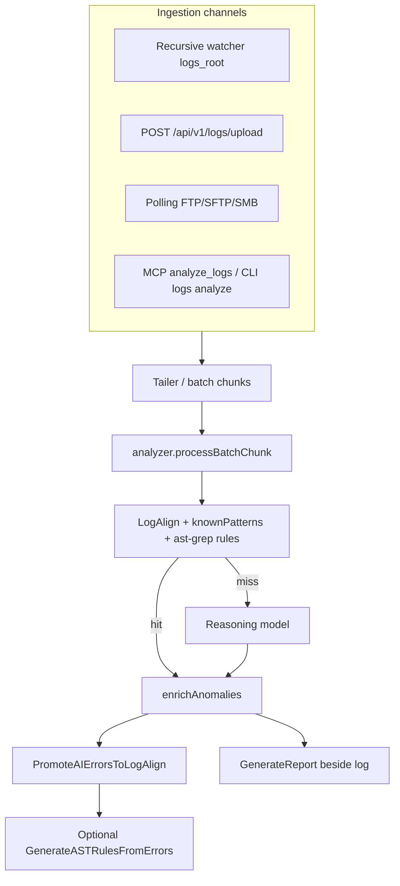

# Log analysis pipeline (current)

> **Status: IMPLEMENTED** (September 2026). Supersedes the “analyze_log_stream” name used in older proposals — the live MCP tool is **`analyze_logs`**.

Companion history: [log_analysis_extension_proposal.md](log_analysis_extension_proposal.md), [log_analysis_implementation_instructions.md](log_analysis_implementation_instructions.md), [changelog_20260918.md](changelog_20260918.md).

## Goals

1. Prefer **deterministic** matches (ast-grep / LogAlign / known patterns) before calling a reasoning model.
2. Produce **actionable reports**: file path, code location, and likely cause — not empty skeletons.
3. Keep AI cost bounded on noisy or repeated errors (chunking, early exit, promote AI hits back into templates).

## End-to-end flow



### Stages (code map)

| Stage | Package / file | Role |
|-------|----------------|------|
| Watch | `internal/ingest/logs/watcher.go` | Recursive fsnotify under `logs_root` |
| Tail | `tailer.go` | Offset-aware reads into analyzable batches |
| Analyze | `analyzer.go` | Static first, then AI; filters noise; respects chunk budgets |
| Enrich | `enrich.go` | Resolve file / symbol / baseline from knowledge graph |
| LogAlign | `logalign.go` | Templates linked to emitting source; promotion from AI |
| AST rules | `ast_rule_gen.go` | Persist `rules/ai-generated-*-logs.yml` when useful |
| Report | `reporter.go` | Markdown report next to the log (`report_<logfile>_<ts>.md`) |

## Operator entry points

### MCP

```text
analyze_logs(project_name, log_text, log_file?)
```

Returns structured anomalies (JSON). When invoked from a watched path, the watcher/reporter path also writes the sidecar markdown report.

### CLI (against a running server)

```bash
ibis-assistant logs analyze --project MyApp --text "ERROR something failed"
# optional: --file logical_name.log
```

### HTTP

`POST /api/v1/logs/upload` — push channel from remote producers (see June 2026 implementation guide).

### Config

- `logs_root` in `config.json` (default often `./logs`)
- SMTP digest / aggregation fields from the completed SMTP reform (see implementation guide)

## Efficiency contract

- Match **knownPatterns / LogAlign / rules under `rules/` + `sgconfig.yml`** before AI.
- Cap / chunk large logs so a single noisy file cannot blow the context window.
- After AI finds a repeatable signature, **promote** it so the next occurrence stays on the static path.

## Verification

- Unit tests: `internal/ingest/logs/*_test.go` (`analyzer`, `enrich`, `logalign`, `ast_rule_gen`)
- Manual: point `logs_root` at real logs (or this repository’s own run logs), run watch or `logs analyze`, confirm the report names the file and a plausible cause when the graph has code context
