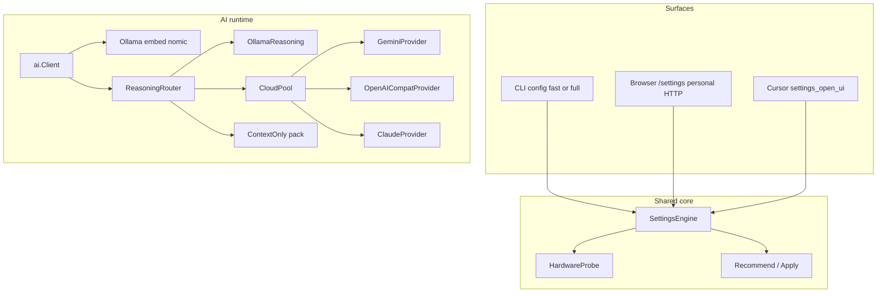

# Hybrid reasoning, local auto-tier, and Settings UX

**Date:** 2026-09-19  
**Status:** Implemented (initial) — see [plan](../plans/2026-09-19-hybrid-reasoning-settings.md)  
**Related:** [ai_generalization_proposal.md](../../ai_generalization_proposal.md), [cli_and_wizard_proposal.md](../../cli_and_wizard_proposal.md), [runtime_modes.md](../../runtime_modes.md)

## Summary

Ibis Assistant gains **local Ollama reasoning** (chat, not only embeddings), a **hybrid local/cloud ReasoningRouter**, a **multi-cloud client pool** (Gemini, OpenAI-compatible, Claude), **hardware-aware model auto-selection** (AMD/NVIDIA/CPU), and a unified **SettingsEngine** driving:

- CLI: `ibis-assistant config` / `config fast` (default) and `config full`
- **Same settings UI** in the browser on personal HTTP (`/settings`) and via Cursor (`settings_open_ui`)

Users enter API keys in the wizard/GUI (plug-and-play). Env vars are optional overrides only—never the primary setup path.

Embeddings stay on `nomic-embed-text`. Chat models never serve as the embedding space.

## Goals

- Default reasoning: `hybrid`.
- Multi-cloud first-class: Gemini, OpenAI-compat, Claude; autoset primary cloud from whichever keys the user configured.
- Local auto-tier, vendor-neutral (AMD via Ollama ROCm probe).
- Plug-and-play secrets: collect keys in wizard/GUI into `config.json` (masked in UI).
- One SettingsEngine for CLI + browser + Cursor.
- English-only UX copy.

## Non-goals

- Replacing Ollama as desktop local runtime (vLLM = server follow-up).
- Cursor `vscode.lm` / `@cursor/sdk` as Go’s LLM backend.
- Full VS Code Extension Host webview as MVP (shared loopback web UI is enough).

## Architecture



### Existing vs new

| Piece | Status |
| ----- | ------ |
| Gemini + multi-key | Exists |
| Ollama embed + runner | Exists |
| CLI wizard | Exists; rewrite |
| Ollama chat, probe, auto-tier, hybrid router | **New** |
| OpenAI-compat + **Claude** providers | **New** |
| CloudPool + autoset `cloud_provider` | **New** |
| Context-only fallback | **New** |
| SettingsEngine + `/settings` UI + MCP `settings_*` | **New** |

## Config shape

```json
{
  "ai": {
    "embedding": {
      "provider": "ollama",
      "model": "nomic-embed-text",
      "url": "http://127.0.0.1:11434",
      "auto_start": true,
      "auto_update": true
    },
    "reasoning": {
      "provider": "hybrid",
      "model": "auto",
      "clouds": {
        "gemini": {
          "keys": [{ "key": "", "rpm": 100, "owner": "default" }]
        },
        "openai_compat": {
          "base_url": "https://api.openai.com/v1",
          "api_key": "",
          "model": "gpt-4.1"
        },
        "claude": {
          "api_key": "",
          "model": "claude-sonnet-4"
        }
      },
      "routing": {
        "mode": "auto",
        "local_provider": "ollama",
        "cloud_provider": "auto",
        "cloud_fallback_order": ["gemini", "openai_compat", "claude"],
        "use_cloud_when_no_gpu": true,
        "local_timeout_ms": 120000
      },
      "model_overrides": {
        "S": "granite4.1:3b",
        "M": "qwen2.5-coder:7b",
        "L": "gemma4:12b",
        "XL": "muse-glimmer"
      },
      "context_only_fallback": true
    }
  }
}
```

Backward compatible: legacy top-level `ai.reasoning.keys` / `gemini_keys` map into `clouds.gemini.keys` on load.

### Plug-and-play keys (no ENV-first setup)

| Rule | Detail |
| ---- | ------ |
| Primary | Wizard **fast/full** and Settings UI **ask for keys** and write them into `config.json` (plugin data dir when `runtime_mode=plugin`). |
| Display | Masked (`sk-…abcd`); never log full secrets. |
| Env | Optional **override** only (`GEMINI_API_KEY`, `OPENAI_API_KEY`, `ANTHROPIC_API_KEY`, etc.) if file keys empty—for CI/power users. Wizard/GUI must **not** tell users “set an env var” as the happy path. |
| Recommend | Autoset `routing.cloud_provider` from configured clouds that have a non-empty key (see below). |

### `routing.cloud_provider`

| Value | Meaning |
| ----- | ------- |
| `auto` | **Default.** Primary = first provider in `cloud_fallback_order` that has credentials; fallbacks = remaining configured clouds. |
| `gemini` / `openai_compat` / `claude` | Force primary; still may fall back to other configured clouds on quota/error unless `mode` forbids it. |

**Autoset on Recommend / Apply when keys change:**

1. Build set of clouds with usable credentials.
2. If empty → hybrid still works local-only; UI prompts to add at least one cloud key for quality path (optional).
3. If `cloud_provider` is `auto` or unset → leave `auto`; resolved primary computed at runtime.
4. If user previously forced a cloud that no longer has a key → Recommend resets to `auto` with reason.

### `use_cloud_when_no_gpu` (renamed)

Replaces the unclear `prefer_cloud_on_cpu`.

| Config key | `use_cloud_when_no_gpu` |
| ---------- | ---------------------- |
| Default | `true` |
| Meaning | When the hardware probe says local inference is **CPU-only** (tier S / Ollama `library=cpu`), send **quality** routes to the cloud if any cloud key exists; keep **bulk** local or skip AI as today. |
| User-facing label (wizard/GUI) | **“On CPU-only PCs, use the cloud for hard questions”** |
| Help text | “Local small models stay available for light work. Hard analysis uses your cloud key so you are not waiting minutes on CPU.” |

Do not use the old name in code, docs, or UI.

### Provider values (`reasoning.provider`)

| Value | Behavior |
| ----- | -------- |
| `hybrid` | Router (product default) |
| `ollama` | Local only |
| `gemini` / `openai_compat` / `claude` | That cloud only |
| `none` | Context-only |

## Hardware probe

Unchanged intent: Ollama GPU report first (ROCm/CUDA/Vulkan/cpu) → WMI/DXGI → optional nvidia-smi/hipinfo → fail-soft tier S. AMD first-class. If GPU in WMI but Ollama on CPU → tier S + `gpu_present_but_ollama_cpu` diagnostic.

### Auto-tier

| Tier | Useful VRAM | Auto model |
| ---- | ------------ | ---------- |
| S | CPU / &lt; 6 GiB / Ollama on CPU | `granite4.1:3b` |
| M | 6–10 GiB | `qwen2.5-coder:7b` |
| L | 10–18 GiB | `gemma4:12b` |
| XL | ≥ ~22–24 GiB + Ollama on GPU | `muse-glimmer` |

Option **Always smallest (`granite4.1:3b`)** forces S model on any PC.

## Ollama reasoning

`OllamaReasoningProvider` via `/api/chat`; reuse runner pull for resolved model; embed stays `nomic-embed-text`.

## ReasoningRouter

| Route class | Destination |
| ----------- | ----------- |
| `bulk_local` | Ollama |
| `quality` | CloudPool primary (if any key); else Ollama |
| Quality + no GPU + `use_cloud_when_no_gpu` | CloudPool if keys exist |
| Failures | Next cloud in order, then other side (local↔cloud), then context-only |

`GenerationConfig.RouteHint`: `bulk` | `quality` | `auto`.

### Context-only

Retrieval yes; no `GenerateContent`; structured pack for host agent. Plugin: fallback always on in fast UI.

## Cloud providers (MVP — all three)

| Provider | Adapter | Credentials in config |
| -------- | ------- | --------------------- |
| Gemini | Existing | `clouds.gemini.keys[]` |
| OpenAI-compatible | New `/v1/chat/completions` | `clouds.openai_compat` (`base_url`, `api_key`, `model`) |
| Claude | New Anthropic Messages API client | `clouds.claude` (`api_key`, `model`) |

`CloudPool` selects primary + ordered fallbacks. Wizard/GUI Cloud screen: add Gemini and/or OpenAI-compat and/or Claude keys (not env instructions).

## SettingsEngine

```text
Probe() (HardwareReport, error)
Recommend(existing *config.Config, probe HardwareReport) Recommendations
Apply(existing *config.Config, choices UserChoices) (*config.Config, Diff, error)
```

- Merge; never wipe stored secrets.
- Env fills gaps only when file empty—never required for Recommend success messaging.
- Field reasons for UI (“Selected gemini as cloud primary because a Gemini key is configured”).

Inventory: runtime, DB, embedding, reasoning (+ clouds), discovery/logs, SMTP, ticketing, git tokens.

## CLI wizard

| Command | Behavior |
| ------- | -------- |
| `ibis-assistant config` | Same as **`config fast`** (default) |
| `ibis-assistant config fast` | Fast path |
| `ibis-assistant config full` | Full/detailed path (all sections) |
| `ibis-assistant config --ai` | AI subsection only (fast-shaped unless `full` also passed) |
| `ibis-assistant config --show` | Non-interactive summary (keys masked) |
| `ibis-assistant config --recommend` | JSON recommendations |

First-run (missing `config.json`) launches **fast**.

### Fast steps

1. Runtime + folder (personal)
2. Probe summary + recommended tier/model
3. AI mode: Hybrid (default) / Local / Cloud / Context-only
4. Cloud keys: prompt to paste Gemini and/or OpenAI-compat and/or Claude into config (skip allowed → local-only hybrid)
5. Local model: Automatic / Always granite3b / Pick
6. Toggle label: “On CPU-only PCs, use the cloud for hard questions” ← `use_cloud_when_no_gpu`
7. Discovery + logs roots
8. Save; optional start

### Full steps

Fast + DB, embed advanced, `base_url`/models per cloud, routing timeouts, tier overrides, SMTP, ticketing, git tokens.

English copy; replace Italian strings in `wizard.go`.

## Settings UI (personal HTTP + Cursor — same UI)

**Committed:** one static settings app.

| Surface | How |
| ------- | --- |
| Personal | Served at `http://127.0.0.1:<port>/settings` on the existing HTTP listener |
| Cursor | MCP `settings_open_ui` opens the same app (personal URL if reachable, else ephemeral localhost listener + one-shot token in plugin mode) |
| CLI | Does not replace wizard; `--show` can print the settings URL when HTTP is up |

Screens: Overview → AI mode → Cloud (multi-key forms) → Local models → Paths → Save with diff.

Security: localhost; token for ephemeral plugin listener; secrets masked.

## Security

- No `0.0.0.0` settings bind in plugin.
- Never log full API keys.
- MCP HTTP Origin rules unchanged.

## Testing

- Tier table; Recommend autoset `cloud_provider=auto` with 0/1/N clouds keyed.
- Router: quality + no GPU + `use_cloud_when_no_gpu` → cloud; without keys → local.
- Claude + OpenAI-compat + Gemini adapters (httptest).
- Wizard: `fast` vs `full` entrypoints.
- `/settings` apply round-trip + token reject.
- Manual AMD ROCm vs CPU fallback.

## Implementation order

1. SettingsEngine + probe + Recommend/Apply  
2. CLI `config fast` / `config full`  
3. `/settings` UI (personal) + MCP `settings_*` + Cursor command  
4. Ollama reasoning + auto-tier  
5. CloudPool: Gemini (wire) + OpenAI-compat + Claude  
6. ReasoningRouter + context-only + `use_cloud_when_no_gpu`  
7. Docs / changelog  

## Open follow-ups (non-blocking)

- Promote `granite4.1:8b` to default M after smoke tests.  
- In-IDE webview later.  
- vLLM for server concurrency.
